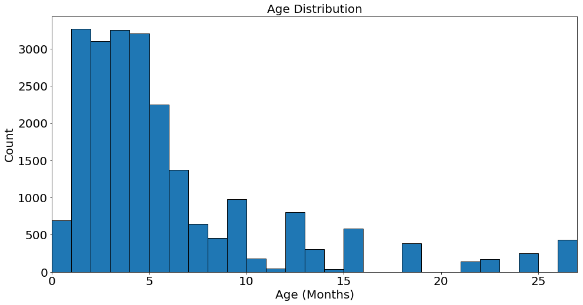
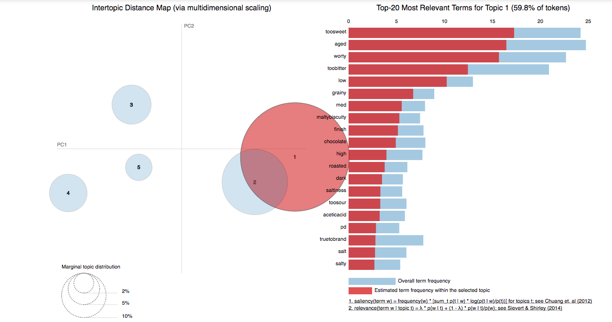
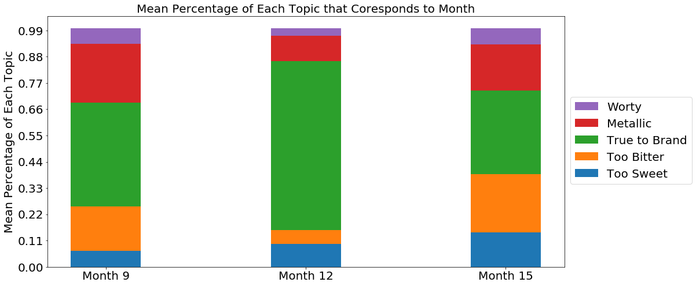

# THE AGE OF BEER #

## BACKGROUND ##
We are living in the Age of Beer, new beers and breweries are being created all of the time. This leads me to think about the question "How old is my Beer?" and that is what this project is about. Fortunately, New Belgium was looking for a way to classify the expiration date or the age that a particular beer is no longer "True to Brand" or TTB. So with New Belgiums help and Data I created this project. My Project is an extension from the work of [Jason Olsons](https://github.com/Jason-Olson/Scoring-Beer-For-New-Belgium) and [Jan Van Zeghbroeck](https://github.com/janvanzeghbroeck/Seeing-Taste). They laid the ground work to clean and structure the comments to use in my analysis.

## GOAL ##
The Goal is to create visualizations that for how a beer changes over time. This will be put into a Flask app that will integrate with what New Belgiums intranet.

## DATA ##
The Data was a set of Comments from New Belgium Beer Testers over 50 beers at different ages. These testers are all rated based on how they have rated beers in the past and how accurate they are with the tests that New Belgium gives them. The projects linked above show us how these ratings were created. A quick summary would be that each tester is rated on how well they are able to identify specific flavors based on taste, aroma, clarity, and body of the beer based on how the master tasters had alter the beer.

The data was very unbalanced with most of the beers only having comments for ages 1 to 5 months old. There were around a quarter of Beers with comments for 9-12 months and then only a couple Beers had ages all the way out to 25 months.

 

##### Figure 1: The Age distribution for all of the Beers #####

Figure 1 is a histogram that shows how the Age is broken up over the whole dataset. You can see that the majority of comments are about beers that are 1 to 5 months old. What this graph doesn't show is a distribution of comments about each individual beers.

## Methods ##

#### Tokenizing and Lemmatizing #####
The first thing I did was use the lexicon that New Belgium uses to change the comments from natural language into the corresponding flavors that their expert tasters have identified as being important to beer. Then I used Spacy to lemmatize the string comment with the corresponding flavors. I used these new final comments to create TF-IDF vectors using the Sklearn library TfidfVectorizer. I used the TFIDF vectors for the rest of the project.

#### LDA ####

My next step for this project was to put my TF-IDF vectors for each comment into topics using a Latent Dirichlet allocation model. An LDA model simultaneously makes topics and groups documents into topics. I broke the vectors up depending on what beer they were talking about and then what question they were referring to (clarity, body, taste, aroma, final). The LDA model with the best separation for the majority of the beers I was looking at was with 5 topics for each beer. The topics for each beer are going to be different but in general below in Figure 2 is what a plot of the LDA module looks like.

 
##### Figure 2: The Visualization of the topics found in Beer B #####

How these topics change over time is what is really interesting. The below plot shows the percentage that each comment on average fits into the above topics.

 

##### Figure 3: The Precent of each topic based on how comments for the taste comments for Beer B #####

Figure 3 shows shows the how the topics can change over time for a specific beer. This graph was actually created from one batch of beer with the cumulative comments from months 9, 12 and 15.

## Final Product ##
The final product is an app that is apart of New Belgiums intranet. This app can update automatically when given new information about a specific type of beer. This update feature will allow New Belgium to continue using my models and predictions when they have the missing data.

## Thanks ##
Thanks to New Belgium Brewery for providing the tasting comments. Thanks to Jan and Matt for making this project possible.
